# Solana Academy Smart Contract

A decentralized education platform built on Solana blockchain that enables academic institutions to manage courses, student enrollments, and handle payments using blockchain technology.

## Features

- Academy initialization and management
- Student enrollment with NFT-based student IDs
- Course creation and management
- Course enrollment system
- Payment handling for both academy enrollment and course fees
- Student progress tracking

## Technical Architecture

### Account Structures

1. **Academy Account**
   - Stores academy name
   - Tracks admin public key
   - Manages course count
   - Sets enrollment fee
   - Tracks student counter

2. **Student Account**
   - Stores student ID
   - Links to student NFT
   - Tracks enrolled classes
   - Manages owned books

3. **Course Account**
   - Stores course details (name, description)
   - Manages course timeline
   - Sets tuition fee
   - Tracks enrollment count

4. **Enrollment Account**
   - Links student to course
   - Tracks enrollment date
   - Monitors completion status

## Key Functions

### Admin Functions

1. `initialize_academy`
   - Initialize new academy
   - Set enrollment fee
   - Set admin privileges

2. `create_course`
   - Create new courses
   - Set course details and tuition
   - Manage course timeline

### Student Functions

1. `enroll_student_in_academy`
   - Process academy enrollment
   - Handle enrollment fee payment
   - Mint student NFT ID

2. `enroll_in_course`
   - Process course enrollment
   - Handle tuition payment
   - Create enrollment record

## Security Features

- NFT-based student identification
- Admin-only course creation
- Payment verification
- Student NFT authority validation
- Course enrollment verification

## Prerequisites

- Solana Tool Suite
- Anchor Framework
- Rust
- Node.js and npm

## Getting Started

1. Clone the repository
```bash
git clone [repository-url]
```

2. Install dependencies
```bash
npm install
```

3. Build the program
```bash
anchor build
```

4. Deploy
```bash
anchor deploy
```

## Testing

Run the test suite:
```bash
anchor test
```

## Architectural Flow

```mermaid
flowchart TD
    subgraph Admin Actions
        A[Admin] -->|Initialize Academy| B[Academy Account]
        B -->|Configure| B1[Set Name]
        B -->|Configure| B2[Set Enrollment Fee]
        B -->|Configure| B3[Set Admin PubKey]
        
        A -->|Create Course| C[Course Account]
        C -->|Set Details| C1[Course Name]
        C -->|Set Details| C2[Description]
        C -->|Set Details| C3[Start/End Dates]
        C -->|Set Details| C4[Tuition Fee]
    end

    subgraph Student Enrollment Flow
        D[New Student] -->|Enroll in Academy| E[Payment Check]
        E -->|If Sufficient Balance| F[Process Payment]
        F -->|Transfer SOL| G[Admin Wallet]
        F -->|Create| H[Student Account]
        F -->|Mint| I[Student NFT]
        H -->|Store| H1[Student ID]
        H -->|Link| H2[NFT PubKey]
    end

    subgraph Course Enrollment Flow
        J[Enrolled Student] -->|Enroll in Course| K[Verification]
        K -->|Verify| K1[Student NFT]
        K -->|Verify| K2[Payment]
        K -->|If Valid| L[Create Enrollment]
        L -->|Initialize| L1[Enrollment Account]
        L1 -->|Store| L2[Student PubKey]
        L1 -->|Store| L3[Course PubKey]
        L1 -->|Store| L4[Enrollment Date]
        L1 -->|Store| L5[Completion Status]
        K2 -->|Transfer SOL| G
    end

    subgraph Account States
        M[Academy State]
        M -->|Tracks| M1[Course Count]
        M -->|Tracks| M2[Student Counter]
        M -->|Tracks| M3[Total Enrollment]

        N[Course State]
        N -->|Tracks| N1[Enrollment Count]
        N -->|Tracks| N2[Course Status]

        O[Student State]
        O -->|Tracks| O1[Enrolled Classes]
        O -->|Tracks| O2[Owned Books]
    end

    %% Relationships
    B -.->|Updates| M
    C -.->|Updates| N
    H -.->|Updates| O
    L1 -.->|Updates| N1
    
    style A fill:#f9f,stroke:#333,stroke-width:2px
    style B fill:#bbf,stroke:#333,stroke-width:2px
    style C fill:#bbf,stroke:#333,stroke-width:2px
    style D fill:#bfb,stroke:#333,stroke-width:2px
    style J fill:#bfb,stroke:#333,stroke-width:2px
    style G fill:#fbb,stroke:#333,stroke-width:2px
```



